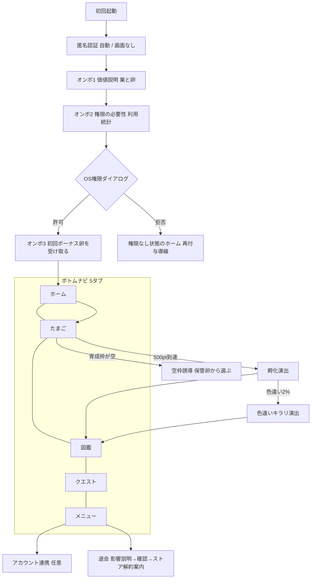
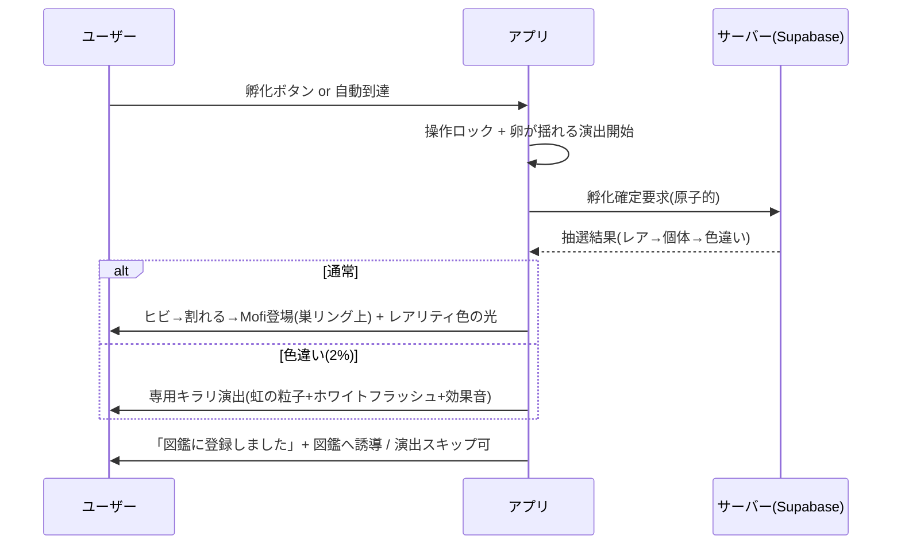
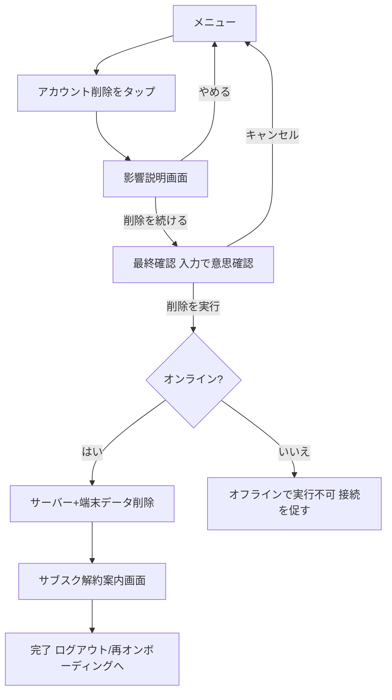

# Moffy 画面フロー & 状態設計 v1.0

> 作成: デザイン部署（product-designer） / 日付: 2026-06-19
> 位置づけ: PRD v1.0 §5（受け入れ条件）を画面に落とした**フロー/状態設計**。各機能は5状態（ハッピー/エラー/ローディング/空/オフライン）を満たして「完成」。
> トークン・コンポーネントは `DESIGN_SYSTEM.md` を参照。専門用語は初出時に日本語説明。

---

## 0. 画面マップ（ボトムナビ5タブ）

> 権限付与は「コアループを1回体験させた後」(PRD S9) が原則だが、利用統計の取得が無いと初日の削減計算ができない。そこで **初回ボーナス卵(S1)はOS権限ナシでも孵化できる固定pt**である利点を使い、**権限ダイアログはオンボ後半に置きつつ、拒否してもボーナス卵でコアループ体験 → その後ホームで再付与を促す**二段構えにする。

---

## 1. 権限付与オンボーディング

**目的**: 利用統計（Android `UsageStatsManager` = アプリ別利用時間を返すOS API）へのアクセス許可を、離脱を最小化して得る。

**画面構成（3枚 + 権限ダイアログ）**
- OB1 価値: 巣の上の卵 + 「SNSを見ない時間が、Mofiを育てる」。`type.display` 見出し + 主役イラスト（巣リング）。スキップ不可、次へのみ。
- OB2 権限の理由: 「利用時間は**端末の中だけで読み取り**、SNS4アプリ(TikTok/Instagram/YouTube/X)の時間だけ見ます。中身は一切見ません」と**安心情報を先出し**してから権限へ。
- 権限ダイアログ: OSネイティブ。アプリからは「設定を開く」導線。
- OB3 初回ボーナス卵: 「最初の卵をプレゼント。3日で孵ります」→ ホームへ。

**5状態**
| 状態 | 設計 |
|---|---|
| ハッピー | OB1→OB2→許可→OB3→ホーム。ボーナス卵が育成枠にセット済み。 |
| エラー | OS設定で許可後にアプリへ戻れない/取得失敗 → 「もう一度ひらく」ボタン + 手順イラスト。トースト `state.error`。 |
| ローディング | 権限確認・初回データ取得中は巣リングが回るスケルトン + 「準備しています」。 |
| 空状態 | 権限はあるがSNSアプリ未使用でデータ0 → ボーナス卵フローへ誘導（実利用に依存しない）。 |
| オフライン | 匿名認証はオンライン必須。オフライン時は「接続すると始められます」+ 再試行。ボーナス卵付与はオンライン復帰時に確定。 |

**権限拒否のリカバリ**: 拒否でもOB3のボーナス卵には進める。ホーム上部に控えめな `state.warn` バナー「利用時間をはかると、もっとMofiが育つよ → 許可する」を常設（責めない・任意感）。

## 2. ホーム（初日ウォームアップ / マイナス日含む）

**役割**: 最も開く画面。第一印象=初動5秒の磨き込み対象。

**画面構成（上→下）**
1. トップバー: ロゴ「Moffy」/ 通貨 `StatBadge`（ジェム・ポイント）/ 通知ベル。
2. **主役 `NestPanel`**: 巣リングの上に育成中の卵 + 吹き出し「孵化まであと◯◯」。署名要素の中心。
3. 孵化までの `ProgressBar`（`warm.orange`）+ 「68%」等を Baloo 数字で。
4. **今日のSNS削減** カード: 「+1時間28分」を `type.numHero`(Baloo) で主役化、`grow.green`。昨日比も。
5. 対象4アプリ別の時間チップ（TikTok/Instagram/YouTube/X、各SVGアイコン+時間）。
6. 「卵を育てる」主CTA（`PrimaryButton`）→ たまご画面。
7. クエスト進捗の小カード。

### 初日ウォームアップの見え方（PRD S1）
| 期間 | ホームの表示 |
|---|---|
| Day1〜2（データ0〜1日） | 基準値は出さない。代わりに「初回ボーナス卵」進捗を主役化。「今日は+200ptプレゼント。あと◯日で孵るよ」。削減数値の枠は「明日から計測スタート」のプレースホルダ。 |
| Day3〜6（暫定基準） | 削減数値を表示。基準値の横に `state.warn` 小ラベル「暫定（7日分たまると確定）」。 |
| Day7〜 | 通常表示。基準値ラベルなし。 |

### マイナス日の責めない文言（PRD S2）
- 削減カードを赤一色にしない。`state.warn` の淡い `warm.apricot` 地で柔らかく。
- 数値: 「今日は +0pt」、サブ:「今日は少し多めだったみたい。明日はMofiのために少し減らそう」。
- 卵プログレスは**減らない**ことを明示（バーは前日のまま、減算アニメは絶対にしない）。
- ミニMofiが寄り添うイラスト（責めずに励ます）。

**5状態**
| 状態 | 設計 |
|---|---|
| ハッピー | 削減プラス。`grow.green` の数字 + 卵プログレス前進。孵化間近なら巣リングが微発光。 |
| エラー | 利用統計の権限なし/取得失敗 → 削減カードに「時間をはかれませんでした」+ 再付与/リトライ。卵や通貨は通常表示（=全画面エラーにしない）。 |
| ローディング | 同期中は削減カードと卵をスケルトン（巣リングの形のシマー）。通貨はキャッシュ即時表示。 |
| 空状態 | 育成枠にアクティブ卵が無い → 主役パネルが「空の巣」+「卵をセットしよう」CTA（→ §3空枠誘導）。プールptの注記。 |
| オフライン | 上端に細い `state.offline` バー「オフライン・あとで同期します」。数値は端末暫定計算（楽観的更新）。復帰時にサーバー確定へ整合（減る方向は上書きしない=S8）。 |

---

## 3. たまご（育成枠 / 孵化演出 / 色違いキラリ / 空枠誘導）

**画面構成**
- 上部: 育成枠3スロット（横並び、巣リング×3）。アクティブ枠を強調（orange縁+微発光）。
- アクティブ卵の詳細: 大きな `NestPanel` + 成長段階（卵→ヒビ①100→ヒビ②250→孵化500）+ `ProgressBar`。
- 下部: 保管枠（無制限）のグリッド。各卵にレアリティ `RarityChip` と成長pt。
- 「育てる卵を切り替え」/「保管庫から入れ替え」操作（PRD S6。成長pt保持）。

### 孵化演出（500pt到達 / PRD §5-2）

- 演出中は操作ロック、右上に「スキップ」。
- レアリティで光の色を変える（§2-3）。SSRは黄金の強い光。

### 色違い専用「キラリ」演出（PRD S13 / グロースの種）
- 通常孵化と**明確に差別化**: ①割れる直前に画面が一瞬ホワイトアウト ②虹色の粒子が巣リングから舞う ③専用SE ④Mofiにレアリティ色の補色のオーラ ⑤「✨色違い！✨」ラベル（文字は袋文字、絵文字でなくSVGきらめき）。
- 演出後に**「シェアする」CTA**を出す（=口コミ拡散の起点。スクショ/画像生成）。
- 図鑑では色違いエントリーに虹枠。

### 空の育成枠誘導（PRD §5-2 空状態）
- 育成枠が空（アクティブ卵なし）: 「空の巣」イラスト + 「次に育てる卵を選ぼう」+ 保管卵一覧をすぐ下に。
- 保管卵もゼロなら: 「クエストやポイントで卵を手に入れよう」→ クエストへ誘導。
- プールpt（最大3日分 / S6）があれば「◯pt ためてあるよ。卵をセットすると使えます」と明示（取りこぼし不安の解消）。

**5状態**
| 状態 | 設計 |
|---|---|
| ハッピー | アクティブ卵にpt累積、段階変化、500で孵化演出→図鑑登録。 |
| エラー | 孵化がサーバーで失敗 → ptを消費せず「もう一度孵す」（二重孵化しない=原子的, S5）。 |
| ローディング | 抽選確定待ちは卵が揺れる演出を継続（=待ち時間を演出に転化）。枠一覧はスケルトン。 |
| 空状態 | 上記「空枠誘導」。 |
| オフライン | 孵化はオンライン確定が原則。「孵化準備完了・接続したら確定します」+ 卵がまばゆく待機。通貨消費を伴う操作はグレーアウト（二重消費防止=S8）。 |

## 4. 図鑑

**画面構成**
- 上部: 達成率「23 / 30」を Baloo 数字で主役化 + 横長 `ProgressBar`。図鑑マイルストーン報酬(S7)の次目標バッジ。
- フィルタ: レアリティ（Common/Rare/SR/SSR）/ 色違いトグル。`RarityChip` の配色で。
- グリッド: 各Mofiサムネ=**巣リング上の円形**（署名要素の反復）。未発見はシルエット（巣だけ残す）。色違いは虹枠。
- 個体タップ: 詳細（画像・名前・レアリティ・種族・発見日時・色違い有無 / 要件定義どおり）。

**5状態**
| 状態 | 設計 |
|---|---|
| ハッピー | 発見済みはカラー、未発見はシルエット。コンプ率が伸びる達成感。 |
| エラー | 同期失敗 → キャッシュ表示 + 「最新の取得に失敗」小バナー + リトライ。 |
| ローディング | サムネを巣リング型シマーで。 |
| 空状態 | 1体も未発見（孵化前） → 「最初のMofiはまだ。卵を育てよう」+ ホーム/たまご誘導。30枠はシルエットで「集める余白」を見せる。 |
| オフライン | キャッシュ表示。新規登録は復帰時に反映。上端 `state.offline` バー。 |

---

## 5. クエスト

**画面構成**
- タブ/セクション: デイリー / ウィークリー。
- ストリーク表示: 連続日数 + 現在倍率（×1.0〜×2.0 / S14）を Baloo 数字で。次マイルストーン(7日/30日)まで。
- 各クエスト: 進捗バー + 報酬アイコン（pt/卵/ジェム、SVG）。達成で「受け取る」CTA。

**5状態**
| 状態 | 設計 |
|---|---|
| ハッピー | 自動生成・進捗反映・達成で報酬演出（小さなきらめき）。ストリーク倍率は基礎ptのみ適用の旨を注記。 |
| エラー | 報酬付与がサーバー失敗 → 二重付与せずリトライ（原子的）。 |
| ローディング | 「今日のクエスト準備中」スケルトン。 |
| 空状態 | 生成前/全達成 → 「今日のクエストは全部クリア！また明日」+ ミニMofiが祝う。 |
| オフライン | 進捗はローカル保持、受け取りはオンライン確定（残高操作のため）。受け取りボタンはオフライン時グレーアウト+理由。 |

---

## 6. メニュー（退会導線含む）

**画面構成**
- プロフィール: 総削減時間 / 総獲得Mofi / 図鑑達成率 / 最長ストリーク / 累計pt（要件定義どおり、数字はBaloo）。
- アカウント: 「アカウントを引き継ぐ（任意）」= Apple(iOS)/Google/メールマジックリンク連携(S10)。**匿名のままでも使える**ことを明示し、強制しない。
- 設定: 通知ON/OFF（5種個別 / S9）、対象アプリ確認、プレミアム、法務文書（プライバシー/利用規約/特商法）、フィードバック(mailto)。
- 最下部に控えめに「アカウント削除」。

### 退会導線（PRD S12 / 審査必須）

- **D2 影響説明**: 「Mofi・図鑑・購入履歴がすべて消え、**復元できません**」を太字。消えるものをアイコンで列挙。責めず事務的に正確に。
- **D3 最終確認**: 誤操作防止に「削除」と入力 or チェック必須。`PrimaryButton` ではなく `state.error` 色の破壊的アクションボタン。
- **D6 サブスク解約案内（重要）**: 「アカウントを削除しても、ストアの定期購読は自動で解約されません。解約は App Store / Google Play の定期購読管理から行ってください」+ 各ストア設定への導線テキスト（アプリからは解約できないため案内のみ / S12）。
- **アプリ外削除窓口**: 同画面と法務文書に mailto/フォーム（=再インストール不要の削除依頼手段 / Google要件）。

**5状態**
| 状態 | 設計 |
|---|---|
| ハッピー | 影響説明→確認→削除→サブスク案内→完了。 |
| エラー | 削除APIが失敗 → 「削除できませんでした。もう一度お試しください」。データは消さない（=中途半端な削除を防ぐ、サーバー原子的処理）。 |
| ローディング | 削除実行中はフルスクリーンで操作ロック + 「削除しています」。 |
| 空状態 | 該当なし（プロフィール統計が全0でも「これから集めよう」表示）。 |
| オフライン | 連携・削除はオンライン必須。導線をグレーアウトし「接続が必要です」と理由表示(S10/S12)。 |

---

## 7. 全画面共通の5状態の見せ方（統一ルール）

| 状態 | 共通表現 | 禁止 |
|---|---|---|
| ローディング | **巣リング型のシマー/スケルトン**（=署名要素で待ち時間も世界観に）。キャッシュがある通貨等は即時表示し全画面ブロックしない。 | 中央に汎用スピナーだけ、を全画面で多用しない |
| エラー | `state.error` トースト or 局所バナー + リトライ。原因が権限なら再付与導線。 | 全画面を真っ赤なエラーにしない／ユーザーを責める文言 |
| 空状態 | 「空の巣」イラスト + 1行コピー + CTA1つ（`EmptyState` コンポーネント）。 | 「データがありません」だけの素っ気ない表示 |
| オフライン | 上端に細い `state.offline` バー + 楽観的更新。書込み系（孵化・通貨消費・連携・削除）はグレーアウト+理由。 | オフラインで通貨消費・孵化確定を許可しない（S8二重防止） |
| マイナス/失敗 | 責めない・喪失を見せない（卵は減らない、減算アニメ禁止 / S2）。 | ペナルティ表現・赤一色 |

